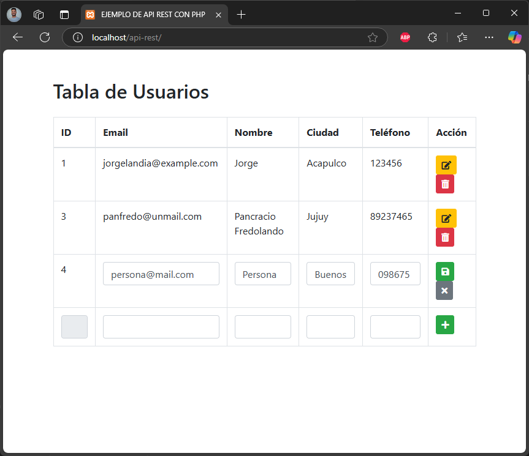

# API REST con PHP
## Introduccion
En este repositorio encontraras un ejemplo de API realizada con php, que realiza consultas a una base de datos MySQL. Adicionalmente para ver el funcionamiento se dispone de una página web sencilla realizada con HTML, Bootstrap y JavaScript que implementa los endpoints de la API.



## Estructura de la API
``` 
\api-rest
  |--\includes
        |-- Database.class.php
        |-- Client.class.php
  |-- create_client.php
  |-- delete_client.php
  |-- get_all_client.php
  |-- update_client.php
```
### Endpoints
* POST create_client.php 
  * link: http://localhost/api-rest/create_client.php
  * body:
    ```
    {
      email: EMAIL_CLIENTE,
      name: NOMBRE_CLIENTE,
      city: CIUDAD_CLIENTE,
      telephone: TELEFONO_CLIENTE
    }
    ```
* DELETE delete_client.php
  * link: http://localhost/api-rest/delete_client.php?id=ID_CLIENTE
* GET get_all_client.php
  * link: http://localhost/api-rest/get_all_client.php
* PUT update_client.php
  * link: http://localhost/api-rest/update_client.php?id=ID_CLIENTE&email=EMAIL_CLIENTE&name=NOMBRE_CLIENTE&city=CIUDAD_CLIENTE&telephone=TELEFONO_CLIENTE

## Instalación
* Instalar XAMPP
* Copiar los archivos del repositorio en la carpeta htdocs
* Iniciar Apache y MySQL
* Abrir phpMyAdmin
* Crear la base de datos 'apirest'
* Importar el script 'listado_clientes.sql' en la base de datos
